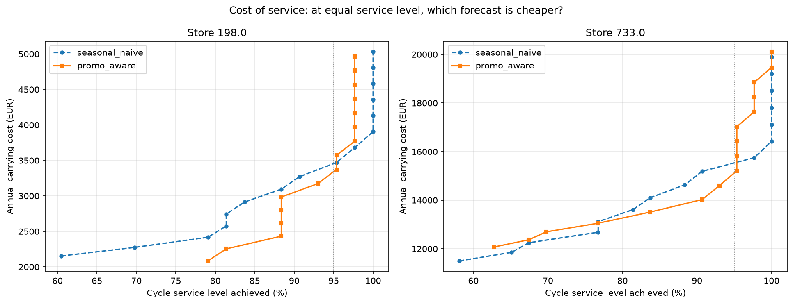

# Forecast-Driven Inventory Control

Evaluating demand forecasts by their effect on inventory cost rather than by
forecast accuracy — and finding that a 62% gain in accuracy makes inventory
cheaper in only 35% of plausible operating conditions.

## The question

Demand forecasting projects are almost always judged on forecast accuracy. But
accuracy is not the objective; inventory performance is. This project started
from a narrow question:

> Does choosing a forecasting model by accuracy produce the best inventory
> outcome?

The answer turned out to be broader than the question. Accuracy is not merely an
imperfect proxy for inventory cost — the ranking it produces reverses under two
other choices that are usually left implicit: how service level is defined, and
what the replenishment lead time is. Both move the answer more than the choice
of forecasting model does.

## Headline findings

1. **A forecast that is 62% more accurate is the cheaper option only 35% of the
   time.** Swept across 46 feasible combinations of lead time, service definition
   and service target, the promo-aware model — which cuts weekly forecast error
   by 62% at one store — is more expensive than the seasonal naive baseline in
   roughly two thirds of them.
2. **The accuracy gain and the inventory gain point at different stores.** A 62%
   improvement in weekly error delivered 13x less saving than a 14% improvement,
   because inventory is exposed to cumulative error across the protection period,
   not to weekly error. Noise cancels over that window; bias does not.
3. **The comparison reverses with the definition of service level.** Matched at
   identical achieved service, the better forecast saves €148/year under a cycle
   service target and costs €978/year under a fill-rate target — the same data,
   the same models, opposite investment decisions.

## Data

Rossmann Store Sales (Kaggle), 1,115 German drugstores, Jan 2013 – Jul 2015,
aggregated to weekly turnover. Two contrasting stores are analysed in depth:

| Store | Weekly mean | CV   | Trading days | Profile        |
|-------|-------------|------|--------------|----------------|
| 733   | €104,201    | 0.09 | 7            | High, stable   |
| 198   | €16,802     | 0.36 | 6            | Low, volatile  |

The contrast is deliberate. An inventory policy tuned on aggregate metrics hides
the fact that these two stores behave nothing alike.

## Method

Rolling-origin backtesting (53 replenishment decisions per store), a periodic
review (R, S) policy simulated against realised demand, and safety stock derived
from the empirical distribution of cumulative forecast error rather than from a
normal-distribution formula.

Two forecasts are compared:

- **Seasonal naive** — same week last year. A deliberately strong retail baseline.
- **Promo-aware conditional mean** — the mean of recent promotion weeks and the
  mean of recent non-promotion weeks over a 26-week window, selected by the
  published promotion plan. No machine learning is used, so any gain is
  attributable to the information rather than to model complexity.

The promotion plan is materialised as a standalone table rather than read from
the sales panel during backtesting. Numerically the values are identical; the
separation makes it auditable that the model reads a published plan, not the
realised future. Promotion schedules are decisions taken by the retailer weeks
ahead — a *known future covariate* — and excluding them would discard information
the planner already holds.

## Key assumptions

Rossmann records turnover, not quantities, and contains no supply-side data.
Assumptions are therefore explicit and treated as parameters, not facts:

| Parameter | Value | Basis |
|-----------|-------|-------|
| Review period R | 1 week | Matches data granularity |
| Lead time L | 2 weeks | Assumed regional DC-to-store; stress-tested at 1–4 weeks |
| Carrying rate | 20% / year | Standard retail range |
| Gross margin | 25% | Drugstore retail benchmark |
| Service level | 95% cycle service | Also evaluated on fill rate |

All costs are expressed as rates on inventory *value*, avoiding an invented unit
price.

---

## Findings

### The two stores serve different customers, and it shows in the data

Daily sales profiles identify what each store is, without any external
information:

| Day       | Store 733 | Store 198   |
|-----------|-----------|-------------|
| Mon–Fri   | ~15,000   | 2,700–4,200 |
| Saturday  | 14,015    | 936         |
| Sunday    | 15,144    | closed      |

Store 733 trades every day at an almost flat rate, Sundays included — the
signature of a transit location serving a passing flow rather than a resident
catchment. Store 198 peaks on Monday, declines through the week and collapses on
Saturday to a quarter of a weekday, indicating a commuter catchment that empties
at the weekend.

### Promotion, not uncertainty, drives most of the observed volatility

Both stores run the same chain-wide promotion calendar (Mon–Fri, 71 of 133
weeks). Their responses differ by an order of magnitude:

| Store | Non-promo week | Promo week | Uplift | Variance explained | CV total → residual |
|-------|----------------|------------|--------|--------------------|---------------------|
| 198   | €10,884        | €22,062    | +103%  | 84.2%              | 0.362 → 0.144       |
| 733   | €100,448       | €108,365   | +8%    | 18.9%              | 0.087 → 0.078       |

This reframes the problem. Promotions are scheduled by the retailer and known
weeks ahead, so the variance they explain is anticipated variation, not
uncertainty. Safety stock exists to absorb what cannot be anticipated. Store 198
is therefore not the volatile store it appears to be: its genuine demand
uncertainty is CV 0.144, not 0.362.

### Forecast accuracy overstates the gap between the stores

Backtested with the seasonal naive baseline over a 3-week protection period:

| Store | Weekly MAPE | Bias | Inventory as % of P-demand | Error autocorrelation |
|-------|-------------|------|----------------------------|-----------------------|
| 198   | 23.9%       | −0.4% | 18.8%                     | 0.57                  |
| 733   | 7.1%        | −3.1% | 12.0%                     | 1.13                  |

MAPE makes store 198 look 3.4x worse than store 733. In inventory terms it is
1.6x worse. Accuracy exaggerates the difference by roughly a factor of two,
because it scores each week independently while inventory is exposed to
*cumulative* error across the protection period — and the two stores' errors
aggregate differently.

Store 198's errors partly cancel: its promotion cycle alternates weekly, so any
three-week window contains roughly 1.5 cycles and over- and under-forecasts
offset. Its cumulative error is 57% of what the independence assumption predicts.
Store 733's errors persist — the store is growing, so a 52-week lookback
under-forecasts consistently — and its cumulative error is 113% of predicted.

The textbook formula SS = z·σ·√L assumes independence and is wrong in both
directions:

| Store | Textbook SS | Empirical SS | Error | Annual cost of the error |
|-------|-------------|--------------|-------|--------------------------|
| 198   | €16,298     | €9,252       | +€7,046 overstock  | €1,409      |
| 733   | €25,296     | €28,578      | −€3,283 understock | €657        |

Store 733 additionally carries an uncorrected forecast bias of €10,110 over the
protection period, costing €2,022 per year — the cheapest available saving here,
since bias is a constant and can be removed by subtracting the historical mean
error.

### The accuracy gain and the inventory gain point at different stores

Replacing the baseline with the promo-aware model:

| Store | MAE improvement | Inventory reduction | Annual saving |
|-------|-----------------|---------------------|---------------|
| 198   | −62%            | −8%                 | €160          |
| 733   | −14%            | −28%                | €2,175        |

The store with the larger accuracy gain delivers 13x less value. This *is* an
inversion, and ranking stores by forecast accuracy would direct investment to
the wrong one.

The mechanism is visible in the autocorrelation factor:

| Store | Model | Autocorrelation | Bias stock | Safety stock |
|-------|-------|-----------------|------------|--------------|
| 198   | seasonal naive | 0.60 | €259    | €9,252  |
| 198   | promo-aware    | 1.40 | €29     | €8,684  |
| 733   | seasonal naive | 1.10 | €10,110 | €28,578 |
| 733   | promo-aware    | 1.10 | €1,361  | €26,453 |

The promo-aware model removes store 198's alternating errors — and removes the
cancellation with them, lifting autocorrelation from 0.60 to 1.40. Weekly error
falls 62% while cumulative error falls 6%. The protection period was already
absorbing most of the problem for free.

Store 733's saving comes almost entirely from bias, which accumulates linearly
and never cancels. Its bias stock falls from €10,110 to €1,361 — and the cause is
not the promotion information but the shorter estimation window, which tracks the
store's growth where a 52-week lookback lags it. Two improvements, two different
mechanisms, two different stores.

### Simulation shows the formula misses the target in both directions

Computing safety stock is a promise; simulating the policy is the evidence. Under
the seasonal naive baseline at a 95% cycle-service target:

| Store | Autocorrelation | CSL achieved | Fill rate |
|-------|-----------------|--------------|-----------|
| 198   | 0.60            | 98%          | ~100%     |
| 733   | 1.10            | 91%          | ~100%     |

Store 198 overshoots because its error distribution is bimodal, not normal: the
alternating promotion cycle produces large errors in either direction and few in
between, so the empirical 95th percentile sits below 1.645σ. Store 733 undershoots
because z·σ covers dispersion but not bias, and its persistent under-forecast is
never compensated.

The promo-aware model achieves exactly 95% at both stores. Its real advantage is
not the small cost saving but **predictability**: a network of 1,115 stores cannot
be managed on a parameter that delivers 91% at one site and 98% at another.

Note also the gap between the two service definitions. Even the worst
configuration meets ~99% of demand. A retailer targeting "95% service" but
meaning fill rate would be substantially overstocked.

### The better forecast pays off below the service level anyone operates at



Read horizontally: at a fixed service level, the vertical gap is what the better
forecast is worth.

Between 79% and 93% cycle service the promo-aware model is materially cheaper at
both stores. At 95% — the level the policy actually targets — the curves converge.
Above 97% the ordering is no longer stable.

At low service levels cost is driven by the centre of the error distribution,
where the promo-aware model wins decisively. At high service levels cost is driven
by the tail, which did not improve proportionally. A forecast that is more
accurate on average is not necessarily safer in the tail, and inventory is exposed
to the tail.

Both frontiers turn near-vertical around 93–95%. At store 198, moving from 95% to
100% cycle service costs roughly €1,500/year — a 43% increase — while fill rate was
already 99.8% at the lower setting.

### The comparison reverses depending on how service level is defined

Matching the two models at identical achieved service on a fine grid:

| Store | Target | Baseline | Promo-aware | Saving |
|-------|--------|----------|-------------|--------|
| 198 | 95% cycle service | €3,471 | €3,323 | **+€148** |
| 198 | 99% fill rate     | €3,141 | €4,119 | **−€978** |
| 733 | 95% cycle service | €15,749 | €15,058 | **+€691** |
| 733 | 98% cycle service | €16,077 | €19,304 | **−€3,226** |

Cycle service counts whether a stockout occurred; fill rate measures how much
demand went unmet. The promo-aware model stocks out less often but more deeply —
consistent with its higher error autocorrelation. On a counting metric it wins; on
a depth metric it loses.

The consequence is organisational rather than technical. An operations team
tracking cycle service and a commercial team committed to a fill-rate SLA would
reach opposite investment decisions from the same data, and each would be correct
on its own metric.

At store 198, a configuration delivering 98% fill rate costs €2,786/year against
€3,471 for one targeting 95% cycle service. A retailer whose true requirement is
fill rate but whose policy is parameterised on cycle service overpays by roughly
25% for a target it does not need.


### Measuring how often the conclusion survives

Rather than showing that a policy tolerates changed assumptions, the sweep
measures how often the *recommendation* does. Three dimensions are varied — lead
time (1–4 weeks), service definition (cycle service and fill rate) and service
target (three levels each) — giving 48 parameter settings, 46 of which are
feasible for both models.

The carrying rate is deliberately not swept. Under cost minimisation subject to a
service constraint it is a pure multiplier: it scales both models identically and
cannot change which is cheaper. Sweeping it yields a larger table and no
information.

**The promo-aware model is cheaper in 35% of settings** (32% at store 198, 38% at
store 733). A model that reduces weekly forecast error by 62% is the more
expensive option in roughly two thirds of the plausible parameter space — and the
figure sits below 50%, so this is a systematic tendency rather than noise.

The pattern is orderly. The promo-aware model wins at short lead times and low
service targets, and loses at long lead times and high targets:

| Store 198, cycle service | P=2 | P=3 | P=4 | P=5 |
|--------------------------|-----|-----|-----|-----|
| 90% | +€296 | +€194 | +€273 | −€236 |
| 95% | +€343 | +€98 | +€177 | −€574 |
| 98% | n/a | n/a | −€2,606 | −€2,940 |
Lead time is the dimension that matters most, and it is the one the dataset
cannot settle. Store 198's promotion calendar alternates weekly, so the
protection period spans 1.0, 1.5, 2.0 or 2.5 promotion cycles depending on lead
time. Its baseline error autocorrelation tracks this non-monotonically (0.41,
0.57, 0.44 at P = 2, 3, 5): cancellation is most complete when the protection
period covers a whole number of cycles. Store 733, where promotion explains only
19% of variance, shows no such oscillation and rises monotonically (1.01, 1.13,
1.22).

This is the same mechanism throughout. At low service targets cost is set by the
centre of the error distribution, where the promo-aware model wins decisively. At
high targets cost is set by the tail, and its error autocorrelation of 1.40 means
errors accumulate rather than cancel there. Operating practice sits in the
lower-right corner of that table: no retailer targets 90% service on a one-week
lead time.

Two cells are undefined because neither model reaches 98% cycle service at store
198 within the observed data. That is a result, not a gap: a retailer committing
to that target at this store would be committing to something the data cannot
demonstrate.

## Conclusion

Three choices move the answer more than the choice of forecasting model does: the
metric used to evaluate forecasts, the definition of service level, and the
assumed lead time. Two are decisions an organisation can make deliberately; the
third is a fact it should measure.

Quantified across the plausible parameter space, the forecast that is clearly
better on accuracy is the cheaper option only 35% of the time — and its advantage
is concentrated in the region where operations do not run.

The recommendation from this analysis is therefore not a model. It is to fix the
evaluation criteria first, measure lead time before spending anything on
forecasting, and prioritise stores by **error bias** and **error autocorrelation**
rather than by MAPE. A noisy but unbiased forecast on a short protection period
may need no improvement at all.

## Hypotheses tested and rejected

**Trading-day noise inflates store 198's volatility.** Rejected. Normalising
weekly sales by the number of trading days reduced CV by only 3.5% (0.362 →
0.349). 110 of 133 weeks have exactly six trading days, so dividing by a
near-constant leaves the coefficient of variation almost unchanged.

**Store 198's weak Saturdays are a data artefact.** Rejected. No open day records
zero sales at either store. Saturday sales are consistently low (median €866,
sd €327) and reflect genuine catchment behaviour.

**Better forecast accuracy reduces required inventory proportionally.** Rejected.
A 62% reduction in weekly MAE produced a 6% reduction in cumulative error, because
the removed errors were the self-cancelling ones.

## Limitations

- **Two stores, chosen for contrast.** These are not a representative sample and
  results should not be extrapolated linearly to the 1,115-store network.
- **Service-level resolution.** Each configuration is scored over 43 weeks
  (53 origins less a 10-week warm-up), so achieved service can only take values
  in steps of 1/43 ≈ 2.3 percentage points. At a 95% target roughly two stockout
  events are observed per configuration, so tail estimates rest on very few
  observations and differences under about 2 points are not distinguishable.
- **Turnover, not units.** Rossmann records euros. Holding cost is applied as a
  rate on value; no unit economics are inferred.
- **No supply-side data.** Lead time, order costs, minimum order quantities and
  supplier reliability are absent. Lead time is stress-tested; the others are not
  modelled.
- **Promotion plan horizon.** The analysis assumes the promotion calendar is fixed
  at least one protection period ahead. If Rossmann finalises promotions later
  than that, the promo-aware model is not implementable as specified.
- **Single-echelon.** Store-level replenishment only; no DC or network effects.

## Repository structure


```text
├── data/
│   ├── raw/                  Rossmann train.csv (not committed)
│   └── processed/            weekly aggregates
├── src/
│   ├── config.py             all policy parameters in one place
│   ├── data_loader.py        daily -> weekly aggregation
│   ├── forecasting.py        forecast models, shared signature
│   ├── backtest.py           rolling-origin evaluation, promotion plan
│   ├── inventory.py          error decomposition, safety stock sizing
│   ├── simulate.py           (R,S) policy simulation, service-cost frontier
│   └── sensitivity.py        multi-dimensional robustness sweep
├── notebooks/
│   ├── 01_data_prep.ipynb    aggregation and store selection
│   ├── 01b_data_audit.ipynb  closures, promotion, variance decomposition
│   └── 02_forecasting.ipynb  backtest, simulation, frontier, stress test
└── outputs/                  figures and result tables
```

Notebooks tell the story; all reusable logic lives in `src/`. Adding a forecast
model means adding a function to `forecasting.py` with the shared signature — no
change to the backtesting loop.

## Reproducing

```bash
git clone <repo-url>
cd forecast-driven-inventory
python -m venv .venv && source .venv/bin/activate
pip install -r requirements.txt
```

Download `train.csv` from the [Rossmann Store Sales competition](https://www.kaggle.com/c/rossmann-store-sales/data)
into `data/raw/`, then run the notebooks in order. All policy parameters are in
`src/config.py`; changing `LEAD_TIME` or `SERVICE_LEVEL` there propagates
everywhere.